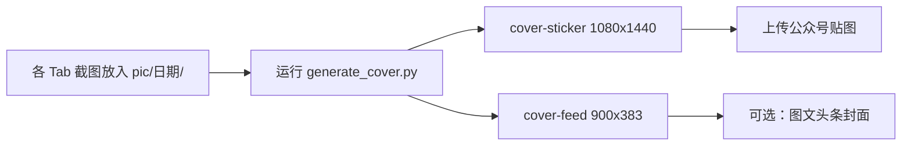

# WeChat Sticker Cover Generator

从 App 各 Tab 截图自动生成微信公众号 **贴图封面**，输出到指定目录（默认与截图同目录）。

## 尺寸规范（2025 常用）

| 场景 | 比例 | 推荐像素 | 输出文件名 |
|------|------|----------|------------|
| **关注的贴图** / 小绿书竖图 | **3:4** | **1080×1440** | `cover-sticker-1080x1440.png` |
| 订阅号头条 / 消息列表 | 2.35:1 | 900×383 | `cover-feed-900x383.png` |
| 次条封面 | 1:1 | 500×500 | 需另做（脚本可扩展） |

参考：[微信开放社区封面说明](https://developers.weixin.qq.com/community/develop/doc/000042ba4286b051a08f7cb5756400)、[图片消息 3:4 最佳比例](https://www.digitaling.com/articles/1338910.html)

图一顶部「关注的贴图」为 **竖版卡片**，优先使用 **1080×1440（3:4）**。

## 品牌与风格

- **主色**：`#FE2C55`（抖音红）+ `#FF6600`（快手橙点缀）
- **背景**：暖奶油色 `#FFF8F5`
- **风格参考**：图二 — 暖色、圆润、轻 3D / 粘土感（脚本用圆角手机框 + 柔光色块模拟；高保真 3D 可用 AI 图生图再叠字）

## 快速使用

### 1. 依赖

```bash
python3 -m pip install Pillow
```

### 2. 生成封面

```bash
cd /path/to/agent
python3 .agents/skills/wechat-sticker-cover/scripts/generate_cover.py \
  --input-dir /Users/yao/Downloads/pic/260524 \
  --title "今天吃啥菜" \
  --subtitle "AI 生成菜谱 · 食材识菜 · 食圈分享"
```

输出写入 `--output-dir`（默认等于 `--input-dir`）：

- `cover-sticker-1080x1440.png`
- `cover-feed-900x383.png`

### 3. Cursor Agent 调用

在 Agent 对话中：

```
/wechat-sticker-cover 为 pic/260524 目录的截图生成公众号贴图封面
```

或：

```
使用 wechat-sticker-cover skill，input-dir 为 ~/Downloads/pic/260524
```

Agent 应：

1. 确认目录内为 Tab 截图（排除已有 `cover-*.png`）
2. 运行 `generate_cover.py`
3. 回报输出路径与尺寸，建议上传 **竖版** 作贴图首图

## 输入要求

- 目录内 `png/jpg/webp`，默认按 `TAB_CATALOG` 文件名前缀排序（首页→心愿→食圈→管理→我的）
- 可选 `screenshots.manifest.json` 指定文件与标签（见 `pic/260524` 示例）
- 已生成封面以 `cover-` 前缀命名，脚本会自动跳过

## 自定义文案

| 参数 | 默认 |
|------|------|
| `--title` | 今天吃啥菜 |
| `--subtitle` | AI 生成菜谱 · 食材识菜 · 食圈分享 |

功能要点列表在脚本内 `bullets`，可按产品改 `generate_cover.py` 中 `bullets` 数组。

## 工作流（推荐）



## 局限与增强

- 脚本为 **排版合成**，非真实 3D 渲染；要图二级粘土插画可再用 `GenerateImage` 作背景后叠标题。
- macOS 使用 PingFang 字体；Linux 需安装中文字体或改 `find_font()` 路径。
- 次条 1:1、组合图 `(900+383)×383` 可按同一风格扩展脚本。
